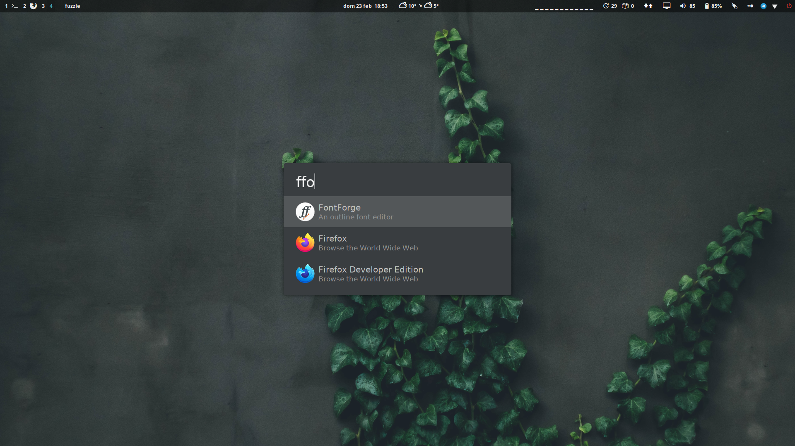

# Fuzzle - Fast fuzzy application launcher

Fuzzle aims to be a really fast application launcher with fuzzy search.




# Features (things might change)
- Opens applications on linux
- Does not work on windows!
- Does not work on mac!
- Does not need a daemon running in background!
- Does not search on the internet!
- Does not search through your files!
- Does not search through your passwords!
- Does not handle your wifi connection!
- Does not translate between languages!
- Does not work as a calculator!

# Note
The project is in a very early stage and things will change and break often for a while.

If you are looking for a working launcher, this project is inspired by:
- [Ulauncher](https://github.com/Ulauncher/Ulauncher)
- [rofi](https://github.com/davatorium/rofi)

# Usage

Download [latest release](https://github.com/Psykopear/fuzzle/releases) and put it somewhere.
Bind the downloaded executable to a shortcut and run it when you need it.

The first time Fuzzle runs it takes some time (less than a second on my pc) to build a cache of existing applications.

After that, it's supposed to give results as fast as you can type.

- Write something to filter results
- Use Tab, Ctrl+j, Ctrl+n or ArrowDown and Ctrl+k, Ctrl+p, Shift+Tab or ArrowUp to go through the results
- Press Enter to open the selected application
- Press Esc to exit Fuzzle.

# Build
Build with:
```
cargo build --release
```

# Credits
Background by Valentyn Ihnatov on Unsplash
